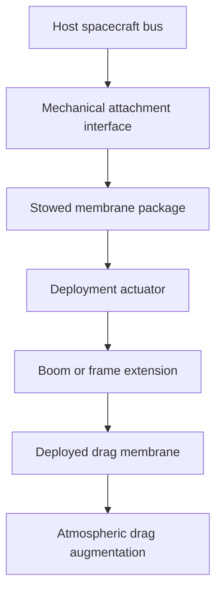
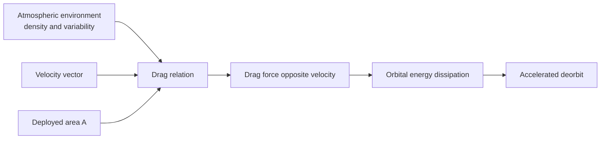
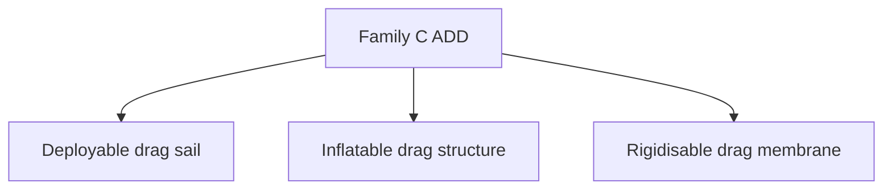
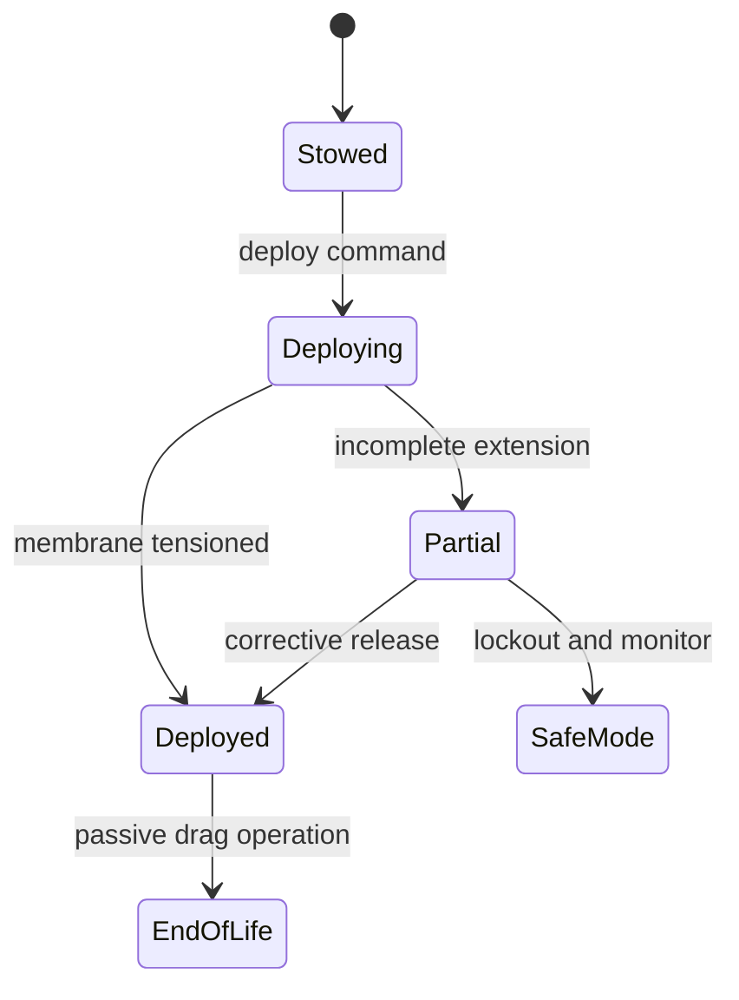

# STA 120-129 · 124-050 — Aerodynamic Drag and Deorbit Devices

## Index

1. [Purpose](#1-purpose)
2. [Scope](#2-scope)
3. [Glossary of Terms and Acronyms](#3-glossary-of-terms-and-acronyms)
4. [Corpus](#4-corpus)
   - [4.1 ADD System Definition and Architecture](#41-add-system-definition-and-architecture)
   - [4.2 Operating Principle — Atmospheric Drag Enhancement](#42-operating-principle--atmospheric-drag-enhancement)
   - [4.3 ADD Variants](#43-add-variants)
   - [4.4 Deployment and Attitude Considerations](#44-deployment-and-attitude-considerations)
   - [4.5 Interface Summary](#45-interface-summary)
   - [4.6 Mission Applicability](#46-mission-applicability)
5. [Notes](#5-notes)
6. [References](#6-references)
7. [Footprint](#7-footprint)

---

## 1. Purpose

Defines the `050` topic for node `124` (*Tether and Propellantless Propulsion*) within STA code range `120-129` (*Propulsión Espacial Tradicional y Avanzada*).

This node specifies **aerodynamic drag and deorbit devices (ADD)** as Family C in the controlled propellantless taxonomy. It covers system architecture, the atmospheric drag principle, ADD sub-families, deployment and attitude considerations, interface boundaries, and mission applicability. It inherits the controlled definition from `124-010` and the selection methodology from `124-020`.[^definition][^selection]

---

## 2. Scope

- Specifies passive area-augmentation systems that increase atmospheric drag to accelerate orbital decay.
- Establishes the architecture and operating principle of ADD without absorbing dynamic-structural detail owned by `124-060`.
- Defers quantitative drag force and deorbit-time envelopes to `124-080`, and safety/debris/disposal assurance closure to `124-090`.[^perf][^safety]
- Preserves subsection governance and inherited assurance boundary controls from `124-000`.[^general][^baseline]
- Supports end-of-life disposal architecture selection where no propellant and no sustained power are available.

---

## 3. Glossary of Terms and Acronyms

| Term / Acronym | Expansion | Meaning in this node |
|---|---|---|
| **ADD** | Aerodynamic Drag Device | Passive area-augmentation hardware for deorbit acceleration in LEO/VLEO. |
| **Drag sail** | — | Deployable membrane held by booms to increase effective cross-sectional area. |
| **Inflatable drag structure** | — | Pressurized deployable structure forming a drag surface with compact stowage. |
| **Rigidisable membrane** | — | Membrane that transitions from flexible stowage to semi-rigid deployed shape. |
| **Ballistic coefficient** | — | Mass-to-drag-area relation governing decay sensitivity in rarefied atmosphere. |
| **Area augmentation** | — | Increase of exposed area as the primary ADD design lever. |
| **One-shot deployment** | — | Deployment concept without routine retraction; common ADD operating mode. |
| **Passive stabilization** | — | Aerodynamic or geometric self-alignment without sustained active control. |

---

## 4. Corpus

### 4.1 ADD System Definition and Architecture

An ADD system is a passive propulsion-surrogate subsystem that increases atmospheric drag by exposing a large deployed surface to free-stream flow. The minimum functional set is a stowed membrane or sail, a deployment mechanism, and a supporting frame or rigidisation concept. ADD creates no thrust and consumes no propellant during operation.

The architectural boundary is intentionally narrow: this node owns ADD configuration and operation logic, while structural deployment dynamics are governed by `124-060`.[^deploy]

### 4.2 Operating Principle — Atmospheric Drag Enhancement

ADD operation is governed by atmospheric drag force, expressed as *F = 0.5 rho v2 C_D A*. In this relationship, **deployed area `A` is the direct design lever** under subsystem control, while atmospheric density and velocity are mission-environment terms.

Drag is one-directional and always opposes velocity, therefore ADD cannot provide reboost or station-keeping. Deorbit effectiveness is governed by ballistic coefficient and atmospheric variability envelopes carried in `124-080`.[^perf]

### 4.3 ADD Variants

Family C includes three controlled variants inherited from `124-010`.[^definition]

| Variant | Deployment reliability posture | Stowed volume posture | Area efficiency posture | Attitude stability posture |
|---|---|---|---|---|
| Deployable drag sail | Mature mechanical concepts; hinge and boom release critical | Moderate | High membrane area efficiency | Depends on center-of-pressure alignment |
| Inflatable drag structure | Inflation integrity critical | Very compact before deployment | Good area gain for packaged volume | Sensitive to pressure retention and shape control |
| Rigidisable membrane | Cure or transition process critical | Compact | High once rigidized | Improved geometric stability after rigidization |

Variant selection remains governed by mission constraints in `124-020`; this node does not redefine taxonomy or criteria.[^selection]

### 4.4 Deployment and Attitude Considerations

Most ADD concepts are one-shot deployments with no nominal retraction. Mission operations therefore emphasize deployment command authority, post-deployment verification, and fail-safe disposal posture.

To maximize drag, the membrane should present favorable projected area to free-stream velocity. Passive stabilization methods such as center-of-pressure offset are preferred; active attitude assist may be used when available. Detailed flexible-body and boom-membrane dynamics are explicitly deferred to `124-060`.[^deploy]

### 4.5 Interface Summary

| Interface | Direction | Description |
|---|---|---|
| **Power** | Host EPS → ADD | Deployment actuation and health monitoring only; no sustained operational demand. |
| **Structures / deployment** | Bidirectional mechanical | Primary interface: stowage, boom/frame loads, membrane attachment, lock features. |
| **GNC** | Host GNC ↔ ADD | Low-demand attitude support; passive stabilization preferred after deployment. |
| **Operations** | Ground → host | Deployment authorization, deployment confirmation, contingency monitoring. |
| **Environment** | External atmosphere → ADD | Neutral-atmosphere drag coupling; no plasma-current interface ownership. |
| **Assurance** | Constraint | Disposal and debris assurance closure governed by `124-090`. |

### 4.6 Mission Applicability

ADD serves one controlled mission function: **end-of-life deorbit acceleration** for LEO and adjacent operational regimes. It is attractive where simplicity, passive behavior, and no-propellant operation are prioritized.

ADD is not applicable to reboost, station-keeping, orbit raising, or transfer maneuvers. Compared with EDT drag mode, ADD does not depend on plasma current collection or geomagnetic-force geometry, but it remains sensitive to atmospheric-density variability captured in `124-080`.[^perf]

---

## 5. Notes

> [!NOTE]
> **N1.** ADD is a passive drag architecture. After successful deployment, sustained subsystem operation is minimal and no propellant chain is required.[^general]

> [!IMPORTANT]
> **N2.** Performance statements for ADD must always include atmospheric model and altitude validity envelopes; standalone deorbit-time claims are non-compliant with subsection governance.[^perf]

> [!WARNING]
> **N3.** One-shot deployment means deployment failure can negate disposal intent. Verification of release, extension, and lock state is therefore a first-order assurance requirement.[^safety]

> [!NOTE]
> **N4.** Structural-flexibility behaviour and membrane dynamics belong to `124-060`; this node only defines ADD architecture and mission role boundaries.[^deploy]

---

## 6. References

[^baseline]: **Q+ATLANTIDE controlled baseline (v1.0.0)** — [`organization/Q+ATLANTIDE.md`](../../../../organization/Q+ATLANTIDE.md).
[^general]: **Subsection general node (124-000)** — [`124-000-General.md`](./124-000-General.md).
[^definition]: **Controlled definition (124-010)** — [`124-010-Tether-and-Propellantless-Propulsion-Controlled-Definition.md`](./124-010-Tether-and-Propellantless-Propulsion-Controlled-Definition.md).
[^selection]: **Families and selection criteria (124-020)** — [`124-020-Propellantless-Families-and-Selection-Criteria.md`](./124-020-Propellantless-Families-and-Selection-Criteria.md).
[^perf]: **Performance bounds and operational envelopes (124-080)** — [`124-080-Performance-Bounds-and-Operational-Envelopes.md`](./124-080-Performance-Bounds-and-Operational-Envelopes.md).
[^safety]: **Safety, debris and assurance boundaries (124-090)** — [`124-090-Safety-Debris-and-Assurance-Boundaries.md`](./124-090-Safety-Debris-and-Assurance-Boundaries.md).
[^subsection]: **Subsection index (124 · Propulsión Sin Propelente y Amarras)** — [`README.md`](./README.md).
[^section]: **Section index (120-129 · Propulsión Espacial Tradicional y Avanzada)** — [`../README.md`](../README.md).
[^archtable]: **STA §3 Architecture Table** — [`../../README.md` §3](../../README.md#3-architecture-table).
[^xref]: **Cross-Architecture Propulsion References** — [`129-070`](../129_Aseguramiento-Calificacion-y-Expansion-de-Propulsion/129-070-Cross-Architecture-Propulsion-References.md).
[^deploy]: **Conductive elements, deployment and dynamics (124-060)** — [`124-060-Conductive-Elements-Deployment-and-Dynamics.md`](./124-060-Conductive-Elements-Deployment-and-Dynamics.md).

---

## 7. Footprint

**Document footprint — controlled provenance and evidence anchor.**

| Field | Value |
|---|---|
| Document ID | `QATL-STA-120-129-124-050` |
| Register | Q+ATLANTIDE1000 |
| Path | `Q+ATLANTIDE/100-199_STA/120-129_Propulsion-Espacial-Tradicional-y-Avanzada/124_Propulsion-Sin-Propelente-y-Amarras/124-050-Aerodynamic-Drag-and-Deorbit-Devices.md` |
| Governance class | baseline |
| Owning Q-Division | Q-SPACE |
| Support Q-Divisions | Q-GREENTECH, Q-STRUCTURES, Q-DATAGOV, Q-HPC, Q-HORIZON |
| ORB functions | ORB-PMO, ORB-LEG |
| Version | 1.0.0 |
| Status | draft-of-record |
| Language | en |
| Evidence anchor (IEF) | `<sha256: to-be-stamped-at-commit>` |
| Programme applicability | none at baseline (technique node; programme trades via impact studies) |

**Change log.**

| Version | Date | Author / Division | Change |
|---|---|---|---|
| 1.0.0 | 2026-05-29 | Q-SPACE | Initial baseline issue of `124-050` Aerodynamic Drag and Deorbit Devices node. |

**Footprint notes.** This node specifies Family C ADD architecture and operational role boundaries. It inherits controlled definition from `124-010` and selection methodology from `124-020`, while deferring dynamic-structural detail to `124-060`, quantitative envelopes to `124-080`, and safety/disposal closure to `124-090`. Programme-specific ADD sizing and verification evidence are generated through impact studies and mapped to `S1000D-CSDB/DMC/` per the canonical hierarchy. The evidence anchor is stamped at commit under the IEF; until stamped, this document is `draft-of-record` for traceability purposes.
