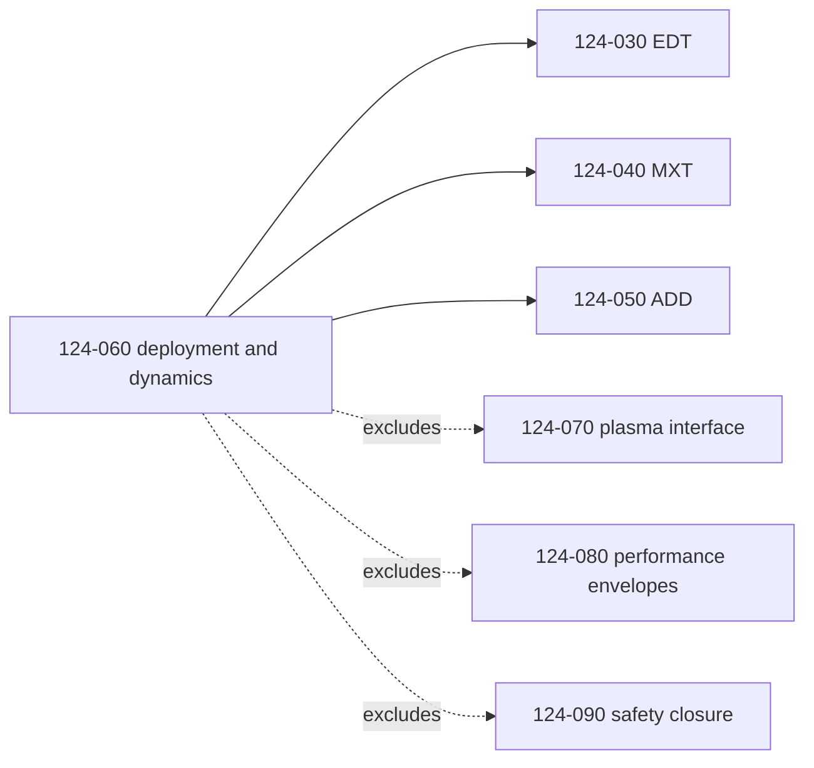
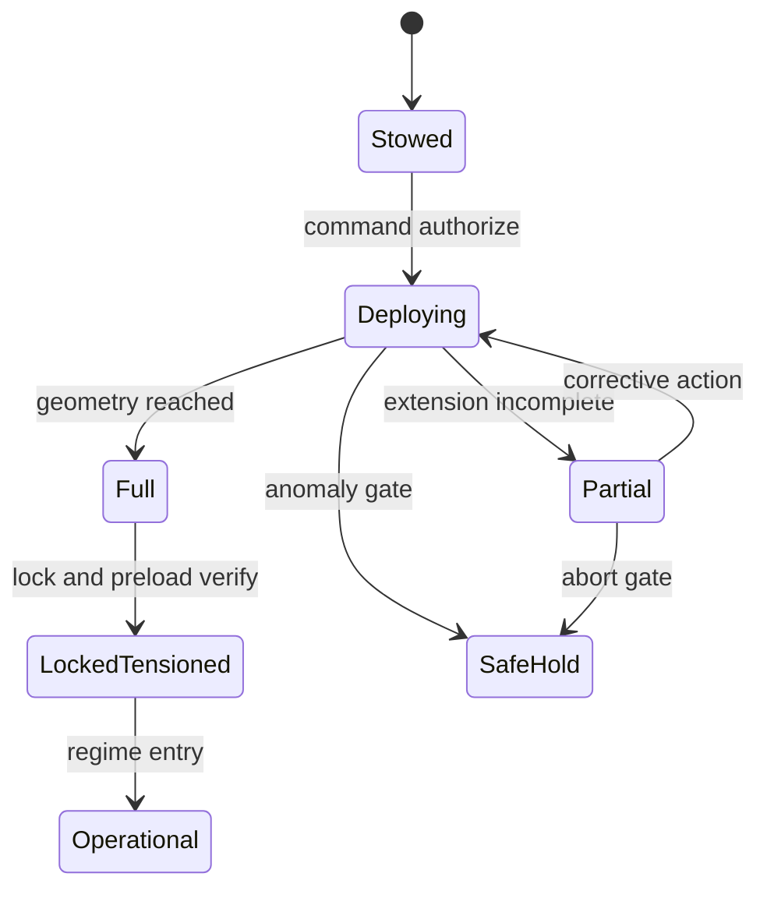
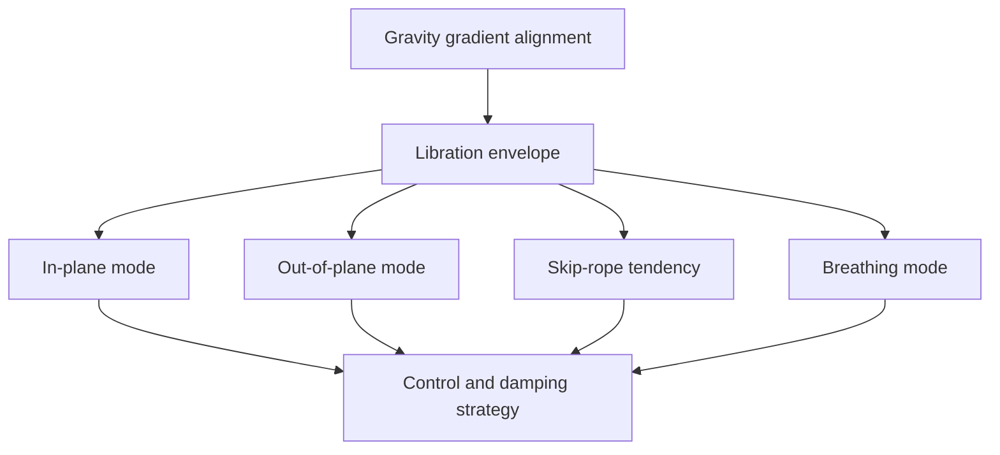

# STA 120-129 · 124-060 — Conductive Elements, Deployment and Dynamics

## Index

1. [Purpose](#1-purpose)
2. [Scope](#2-scope)
3. [Glossary of Terms and Acronyms](#3-glossary-of-terms-and-acronyms)
4. [Corpus](#4-corpus)
   - [4.1 Scope of Cross-Cutting Coverage](#41-scope-of-cross-cutting-coverage)
   - [4.2 Deployment Mechanisms and Sequences](#42-deployment-mechanisms-and-sequences)
   - [4.3 Tether Dynamics — Libration and Oscillation](#43-tether-dynamics--libration-and-oscillation)
   - [4.4 Membrane Dynamics](#44-membrane-dynamics)
   - [4.5 Structural Loads and Failure Modes](#45-structural-loads-and-failure-modes)
   - [4.6 Interface Summary](#46-interface-summary)
   - [4.7 Applicability Across Families](#47-applicability-across-families)
5. [Notes](#5-notes)
6. [References](#6-references)
7. [Footprint](#7-footprint)

---

## 1. Purpose

Defines the `060` topic for node `124` (*Tether and Propellantless Propulsion*) within STA code range `120-129`.

This node owns the **deployment and dynamic-stability layer** shared by EDT, MXT, and ADD. It governs mechanism classes, deployment state transitions, libration and oscillation behavior, membrane dynamic effects, and structural-load/failure mechanics across families. It does not own the system architecture of any technique family, which remains in `124-030`, `124-040`, and `124-050`.[^edt][^mxt][^add]

---

## 2. Scope

- Covers deployment mechanisms and deployment-state control for tether and membrane systems.
- Covers dynamic behavior: libration, oscillation, flutter, billowing, thermal distortion, and damping approaches.
- Covers structural loads and failure mechanics, including severance mechanics.
- Defers plasma-environment interface physics to `124-070`, quantitative performance envelopes to `124-080`, and safety-case closure to `124-090`.[^plasma][^perf][^safety]
- Inherits definitions and selection methodology from `124-010` and `124-020`.[^definition][^selection]

---

## 3. Glossary of Terms and Acronyms

| Term / Acronym | Expansion | Meaning in this node |
|---|---|---|
| **Libration** | — | Low-frequency pendular tether motion about local vertical. |
| **In-plane mode** | — | Libration component in orbital plane. |
| **Out-of-plane mode** | — | Libration component normal to orbital plane. |
| **Skip-rope mode** | — | Dynamic mode where tether rotates around its own stretched axis path. |
| **Breathing mode** | — | Axial extension-contraction oscillation along tether length. |
| **Snatch load** | — | Peak transient tension at line tautening during deployment events. |
| **Flutter** | — | Self-excited membrane oscillation driven by flow-structure coupling. |
| **Billowing** | — | Quasi-static out-of-plane membrane deformation in free-stream flow. |
| **Locked tension state** | — | Deployed state where geometry and pre-load are within controlled limits. |

---

## 4. Corpus

### 4.1 Scope of Cross-Cutting Coverage

`124-060` is cross-cutting by design. It applies to all three families while preserving ownership boundaries: architecture and operating principles stay in technique nodes, environment coupling stays in `124-070`, and quantitative values stay in `124-080`.[^perf]

This separation prevents cross-containment and keeps assurance traceability auditable.

### 4.2 Deployment Mechanisms and Sequences

Deployment mechanisms vary by family but share a common state-governance model. Typical tether deployers include spring-ejection, motor-driven reel, and gravity-gradient assisted release. Membrane deployers include inflatable boom, coiled longeron extension, and spin-aided unfurling.

Retraction capability is family-dependent: EDT may support retrieval in some architectures, ADD is usually non-retractable, and MXT facilities may retract for maintenance or survivability operations.[^edt][^add][^mxt]

### 4.3 Tether Dynamics — Libration and Oscillation

Long deployed tethers exhibit multi-mode dynamics. Gravity-gradient alignment provides first-order stabilization but does not suppress all oscillatory modes. In-plane and out-of-plane libration can couple with operational forcing, and long systems may exhibit skip-rope and breathing modes.

Damping can be passive (material hysteresis, dampers) or active (EDT current modulation, MXT spin control). Dynamic limits and allowable envelopes are referenced in `124-080`.[^perf]

### 4.4 Membrane Dynamics

Membrane systems in ADD are governed by coupled boom-membrane behaviour under rarefied aerodynamic forcing and thermal gradients. Flutter and billowing affect projected area and attitude stability, while thermal distortion can bias passive alignment performance.

Spin-stabilized membrane concepts can improve geometric regularity but impose additional spin-control and verification requirements. This node owns the dynamic mechanics; family-level mission role remains in `124-050`.[^add]

### 4.5 Structural Loads and Failure Modes

Deployment loads include release shock and snatch events during line tautening. Operational loads include tension cycling, torsion, and fatigue accumulation from libration or spin cycles. Environmental degradation includes atomic oxygen exposure, ultraviolet aging, and thermal cycling effects on joints and membranes.

Severance by debris or micrometeoroid impact is treated here as a **structural failure mechanism**. Collision probability, debris policy, and disposal assurance closure are owned by `124-090`.[^safety]

| Load or failure class | Typical trigger | Primary effect | Primary owner |
|---|---|---|---|
| Deployment snatch | Rapid tautening during extension | Peak tension and local overstress | `124-060` |
| Libration fatigue | Long-duration oscillatory cycles | Material fatigue accumulation | `124-060` |
| Membrane flutter | Flow-structure instability | Area-loss and attitude coupling | `124-060` |
| Thermal distortion | Orbital thermal cycling | Shape drift and preload changes | `124-060` |
| Severance event | Debris or micrometeoroid strike | Loss of continuity and split bodies | `124-060` mechanics + `124-090` assurance |

### 4.6 Interface Summary

| Interface | Direction | Description |
|---|---|---|
| **Structures** | Bidirectional mechanical | Deployment hardware integration, load paths, attachment and lock states. |
| **GNC** | Bidirectional | Dynamic-state estimation, libration or spin feedback, operational constraint enforcement. |
| **Operations** | Ground and onboard → deployment system | Deployment commands, anomaly gates, hold or abort transitions. |
| **Assurance** | Evidence out | Test and analysis evidence for deployment success and dynamic stability margins. |
| **Thermal** | Environment and host thermal ↔ deployed elements | Thermal distortion and material-condition impacts on dynamic behavior. |

### 4.7 Applicability Across Families

This node applies to EDT, MXT, and ADD with different emphasis.

| Concern | EDT | MXT | ADD |
|---|---|---|---|
| Reel or line deployment control | Core | Core | Limited |
| Spin-dynamic management | Optional | Core | Optional |
| Libration damping | Core | Core | Low to moderate |
| Membrane flutter and billowing | Not primary | Not primary | Core |
| Retractability operations | Possible in some concepts | Possible for facility servicing | Usually not nominal |
| Structural severance mechanics | Core | Core | Core |

Mission applicability impact is qualitative in this node; quantitative impact remains in `124-080`.[^perf]

---

## 5. Notes

> [!NOTE]
> **N1.** Cross-cutting ownership in `124-060` is mandatory for consistency: family nodes must reference this node for deployment and dynamic mechanics rather than duplicating criteria.[^edt][^mxt][^add]

> [!IMPORTANT]
> **N2.** Deployment-state governance should be implemented as explicit transition gates with verifiable completion criteria; implicit state assumptions are not acceptable in assurance evidence chains.[^safety]

> [!WARNING]
> **N3.** Dynamic instability can amplify structural loads rapidly. Operations must include hold or abort logic before entering full operational modes after incomplete deployment.

> [!NOTE]
> **N4.** Structural severance mechanics are owned here, but collision-risk acceptance and disposal closure are governed in `124-090` to preserve assurance traceability boundaries.[^safety]

---

## 6. References

[^baseline]: **Q+ATLANTIDE controlled baseline (v1.0.0)** — [`organization/Q+ATLANTIDE.md`](../../../../organization/Q+ATLANTIDE.md).
[^general]: **Subsection general node (124-000)** — [`124-000-General.md`](./124-000-General.md).
[^definition]: **Controlled definition (124-010)** — [`124-010-Tether-and-Propellantless-Propulsion-Controlled-Definition.md`](./124-010-Tether-and-Propellantless-Propulsion-Controlled-Definition.md).
[^selection]: **Families and selection criteria (124-020)** — [`124-020-Propellantless-Families-and-Selection-Criteria.md`](./124-020-Propellantless-Families-and-Selection-Criteria.md).
[^perf]: **Performance bounds and operational envelopes (124-080)** — [`124-080-Performance-Bounds-and-Operational-Envelopes.md`](./124-080-Performance-Bounds-and-Operational-Envelopes.md).
[^safety]: **Safety, debris and assurance boundaries (124-090)** — [`124-090-Safety-Debris-and-Assurance-Boundaries.md`](./124-090-Safety-Debris-and-Assurance-Boundaries.md).
[^subsection]: **Subsection index (124 · Propulsión Sin Propelente y Amarras)** — [`README.md`](./README.md).
[^section]: **Section index (120-129 · Propulsión Espacial Tradicional y Avanzada)** — [`../README.md`](../README.md).
[^archtable]: **STA §3 Architecture Table** — [`../../README.md` §3](../../README.md#3-architecture-table).
[^xref]: **Cross-Architecture Propulsion References** — [`129-070`](../129_Aseguramiento-Calificacion-y-Expansion-de-Propulsion/129-070-Cross-Architecture-Propulsion-References.md).
[^edt]: **Electrodynamic tether systems (124-030)** — [`124-030-Electrodynamic-Tether-Systems.md`](./124-030-Electrodynamic-Tether-Systems.md).
[^mxt]: **Momentum exchange and spinning tethers (124-040)** — [`124-040-Momentum-Exchange-and-Spinning-Tethers.md`](./124-040-Momentum-Exchange-and-Spinning-Tethers.md).
[^add]: **Aerodynamic drag and deorbit devices (124-050)** — [`124-050-Aerodynamic-Drag-and-Deorbit-Devices.md`](./124-050-Aerodynamic-Drag-and-Deorbit-Devices.md).
[^plasma]: **Plasma and geomagnetic environment interface (124-070)** — [`124-070-Plasma-and-Geomagnetic-Environment-Interface.md`](./124-070-Plasma-and-Geomagnetic-Environment-Interface.md).

---

## 7. Footprint

**Document footprint — controlled provenance and evidence anchor.**

| Field | Value |
|---|---|
| Document ID | `QATL-STA-120-129-124-060` |
| Register | Q+ATLANTIDE1000 |
| Path | `Q+ATLANTIDE/100-199_STA/120-129_Propulsion-Espacial-Tradicional-y-Avanzada/124_Propulsion-Sin-Propelente-y-Amarras/124-060-Conductive-Elements-Deployment-and-Dynamics.md` |
| Governance class | baseline |
| Owning Q-Division | Q-SPACE |
| Support Q-Divisions | Q-GREENTECH, Q-STRUCTURES, Q-DATAGOV, Q-HPC, Q-HORIZON |
| ORB functions | ORB-PMO, ORB-LEG |
| Version | 1.0.0 |
| Status | draft-of-record |
| Language | en |
| Evidence anchor (IEF) | `<sha256: to-be-stamped-at-commit>` |
| Programme applicability | none at baseline (cross-cutting node; programme dynamics and tests via impact studies) |

**Change log.**

| Version | Date | Author / Division | Change |
|---|---|---|---|
| 1.0.0 | 2026-05-29 | Q-SPACE | Initial baseline issue of `124-060` Conductive Elements, Deployment and Dynamics node. |

**Footprint notes.** This node controls deployment and dynamic behavior boundaries across Family A EDT, Family B MXT, and Family C ADD without absorbing family-architecture ownership. It establishes deployment-state logic, dynamic mode taxonomy, structural-load classes, and failure mechanics as shared engineering controls. Safety closure remains in `124-090` and quantitative envelopes remain in `124-080`. Programme-level dynamic models, test campaigns, and acceptance criteria are generated via impact studies and mapped to `S1000D-CSDB/DMC/` per the canonical hierarchy. The evidence anchor is stamped at commit under the IEF; until stamped, this document is `draft-of-record`.
