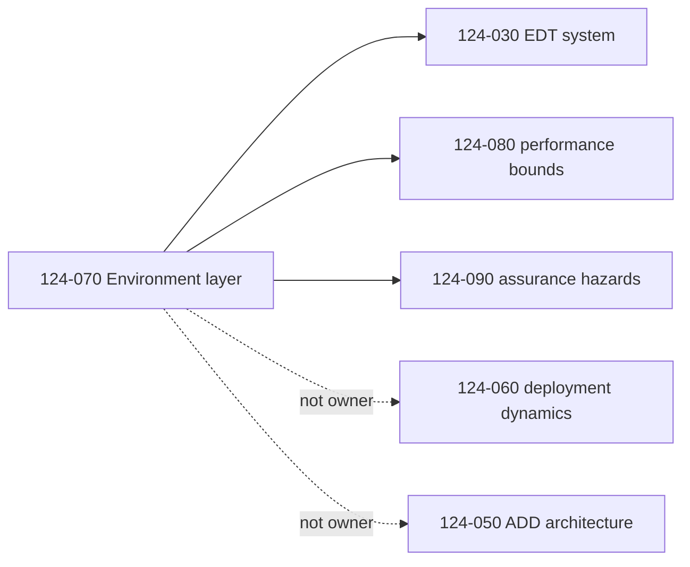
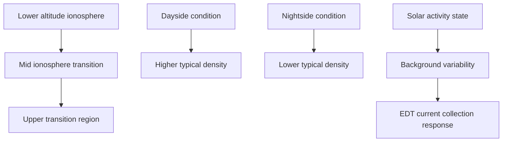
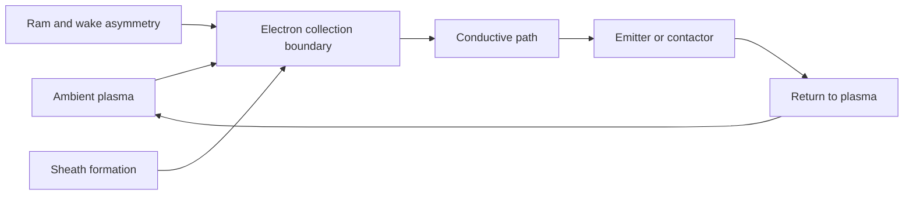
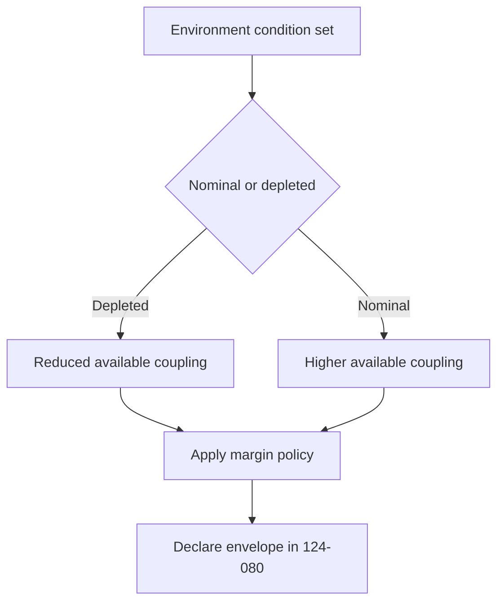

# STA 120-129 · 124-070 — Plasma and Geomagnetic Environment Interface

## Index

1. [Purpose](#1-purpose)
2. [Scope](#2-scope)
3. [Glossary of Terms and Acronyms](#3-glossary-of-terms-and-acronyms)
4. [Corpus](#4-corpus)
   - [4.1 Scope of Environment Interface Coverage](#41-scope-of-environment-interface-coverage)
   - [4.2 Ionospheric Plasma Environment](#42-ionospheric-plasma-environment)
   - [4.3 Geomagnetic Field Geometry](#43-geomagnetic-field-geometry)
   - [4.4 Current Collection Physics](#44-current-collection-physics)
   - [4.5 Environment Variability and Margins](#45-environment-variability-and-margins)
   - [4.6 Interface Summary](#46-interface-summary)
   - [4.7 Applicability Across Families](#47-applicability-across-families)
5. [Notes](#5-notes)
6. [References](#6-references)
7. [Footprint](#7-footprint)

---

## 1. Purpose

Defines the `070` topic for node `124` by governing the **environment-coupling physics layer** for tether and propellantless propulsion.

This node owns ionospheric plasma properties, geomagnetic-field geometry, current-collection behaviour, and variability-driven margins that condition subsection performance interpretation. It primarily serves EDT (`124-030`), supports MXT where conductive subsystems are integrated, and bounds atmospheric-environment context relevant to ADD (`124-050`).[^edt][^mxt][^add]

---

## 2. Scope

- Covers plasma-density and temperature context and geomagnetic-geometry dependencies.
- Covers EDT current-collection and contactor interaction with ambient environment.
- Covers variability and margin logic that must accompany performance statements in `124-080`.[^perf]
- Defers EDT system architecture to `124-030`, deployment dynamics to `124-060`, and assurance closure to `124-090`.[^edt][^deploy][^safety]
- Inherits definitions and taxonomy ownership from `124-010` and `124-020`.[^definition][^selection]

---

## 3. Glossary of Terms and Acronyms

| Term / Acronym | Expansion | Meaning in this node |
|---|---|---|
| **IGRF** | International Geomagnetic Reference Field | Reference model for field strength and direction in EDT analyses. |
| **OML** | Orbital-Motion Limited | Bare-conductor current-collection regime used in EDT modeling. |
| **Ram side** | — | Flow-facing side of a moving tether where collection conditions differ from wake side. |
| **Wake side** | — | Plasma-shadowed region with altered sheath and reduced collection behavior. |
| **Sheath** | — | Non-neutral boundary region near conductive surfaces immersed in plasma. |
| **SAA** | South Atlantic Anomaly | Region with altered radiation and magnetic conditions relevant to lifetime concerns. |
| **Space-charge limit** | — | Current limit caused by local charge accumulation constraining extraction or collection. |
| **Contactor plume** | — | Local plasma or electron environment generated by active contactor emission. |

---

## 4. Corpus

### 4.1 Scope of Environment Interface Coverage

This node governs environmental coupling. It defines how the external space environment conditions subsystem behavior, not the hardware architecture itself.

The governance rule is explicit: performance numbers without stated environment envelope are non-compliant and are controlled in `124-080`.[^perf]

### 4.2 Ionospheric Plasma Environment

Ionospheric plasma conditions vary with altitude, latitude, local time, season, and solar activity regime. Electron density and temperature shape current collection potential for EDT concepts. Composition transitions between oxygen-dominant and lighter-ion regimes affect collection and sheath behavior.

Storm-time and seasonal effects can shift environment assumptions quickly, so mode planning and margin logic must include degraded and elevated conditions.[^perf]

### 4.3 Geomagnetic Field Geometry

Geomagnetic force coupling depends on local field magnitude and orientation relative to tether geometry and orbital velocity. The geomagnetic equator and geographic equator are not equivalent reference sets for EDT force prediction.

Field geometry influences effective Lorentz-force direction and duty-cycle availability. SAA passages may also influence contactor-lifetime stress and operational mode planning.

### 4.4 Current Collection Physics

EDT current flow depends on collection-emission closure through plasma. Bare-wire concepts are typically analyzed with OML assumptions, while end-contacted concepts emphasize emitter and collector endpoint behaviour.

Space-charge limitations, sheath dynamics, and contactor-plume interactions define practical operating bounds and must be represented in validity envelopes.[^perf]

### 4.5 Environment Variability and Margins

Environment variability maps directly into subsystem force and control variability for EDT, and indirectly into mission-planning confidence for all families.

Margin policy should include depletion cases, elevated disturbance cases, and model-validity boundaries. This node defines logic; `124-080` carries declared quantitative envelopes.[^perf]

### 4.6 Interface Summary

| Interface | Direction | Description |
|---|---|---|
| **Plasma environment** | External → subsystem | Electron and ion properties drive EDT coupling capability. |
| **Geomagnetic field** | External → subsystem | Field orientation and magnitude determine force-direction efficiency. |
| **GNC sensing and estimation** | Environment data → host GNC | Real-time condition awareness supports mode scheduling and control authority planning. |
| **Thermal** | Contactor and electronics ↔ thermal subsystem | Environment-driven emission and collection states affect local thermal loads. |
| **Operations** | Mission operations ↔ environment model updates | Eclipse, latitude, and disturbance aware mode switching policy. |

### 4.7 Applicability Across Families

- **EDT (`124-030`)**: primary consumer; environment coupling is mission-critical.
- **MXT (`124-040`)**: secondary relevance when integrated EDT reboost or conductive subsystems are used.
- **ADD (`124-050`)**: primarily governed by neutral atmosphere rather than plasma physics; this node provides only boundary linkage and defers atmosphere-detail modelling to programme astrodynamics artefacts while retaining `124-080` envelope governance.[^perf]

---

## 5. Notes

> [!NOTE]
> **N1.** Plasma and geomagnetic coupling is not static. Time-of-day, latitude, and solar-condition variability must be treated as first-class inputs in operations and performance interpretation.[^perf]

> [!IMPORTANT]
> **N2.** Environment assumptions used in analysis must be traceable and versioned; otherwise performance and assurance evidence chains are not auditable.

> [!WARNING]
> **N3.** Using EDT performance claims without explicit environment validity conditions is a governance defect and can misstate mission feasibility.[^perf][^general]

> [!NOTE]
> **N4.** This node does not own deployment mechanics or family architectures; those boundaries remain in `124-060` and the technique nodes.[^deploy][^edt][^mxt][^add]

---

## 6. References

[^baseline]: **Q+ATLANTIDE controlled baseline (v1.0.0)** — [`organization/Q+ATLANTIDE.md`](../../../../organization/Q+ATLANTIDE.md).
[^general]: **Subsection general node (124-000)** — [`124-000-General.md`](./124-000-General.md).
[^definition]: **Controlled definition (124-010)** — [`124-010-Tether-and-Propellantless-Propulsion-Controlled-Definition.md`](./124-010-Tether-and-Propellantless-Propulsion-Controlled-Definition.md).
[^selection]: **Families and selection criteria (124-020)** — [`124-020-Propellantless-Families-and-Selection-Criteria.md`](./124-020-Propellantless-Families-and-Selection-Criteria.md).
[^perf]: **Performance bounds and operational envelopes (124-080)** — [`124-080-Performance-Bounds-and-Operational-Envelopes.md`](./124-080-Performance-Bounds-and-Operational-Envelopes.md).
[^safety]: **Safety, debris and assurance boundaries (124-090)** — [`124-090-Safety-Debris-and-Assurance-Boundaries.md`](./124-090-Safety-Debris-and-Assurance-Boundaries.md).
[^subsection]: **Subsection index (124 · Propulsión Sin Propelente y Amarras)** — [`README.md`](./README.md).
[^section]: **Section index (120-129 · Propulsión Espacial Tradicional y Avanzada)** — [`../README.md`](../README.md).
[^archtable]: **STA §3 Architecture Table** — [`../../README.md` §3](../../README.md#3-architecture-table).
[^xref]: **Cross-Architecture Propulsion References** — [`129-070`](../129_Aseguramiento-Calificacion-y-Expansion-de-Propulsion/129-070-Cross-Architecture-Propulsion-References.md).
[^edt]: **Electrodynamic tether systems (124-030)** — [`124-030-Electrodynamic-Tether-Systems.md`](./124-030-Electrodynamic-Tether-Systems.md).
[^mxt]: **Momentum exchange and spinning tethers (124-040)** — [`124-040-Momentum-Exchange-and-Spinning-Tethers.md`](./124-040-Momentum-Exchange-and-Spinning-Tethers.md).
[^add]: **Aerodynamic drag and deorbit devices (124-050)** — [`124-050-Aerodynamic-Drag-and-Deorbit-Devices.md`](./124-050-Aerodynamic-Drag-and-Deorbit-Devices.md).
[^deploy]: **Conductive elements, deployment and dynamics (124-060)** — [`124-060-Conductive-Elements-Deployment-and-Dynamics.md`](./124-060-Conductive-Elements-Deployment-and-Dynamics.md).

---

## 7. Footprint

**Document footprint — controlled provenance and evidence anchor.**

| Field | Value |
|---|---|
| Document ID | `QATL-STA-120-129-124-070` |
| Register | Q+ATLANTIDE1000 |
| Path | `Q+ATLANTIDE/100-199_STA/120-129_Propulsion-Espacial-Tradicional-y-Avanzada/124_Propulsion-Sin-Propelente-y-Amarras/124-070-Plasma-and-Geomagnetic-Environment-Interface.md` |
| Governance class | baseline |
| Owning Q-Division | Q-SPACE |
| Support Q-Divisions | Q-GREENTECH, Q-STRUCTURES, Q-DATAGOV, Q-HPC, Q-HORIZON |
| ORB functions | ORB-PMO, ORB-LEG |
| Version | 1.0.0 |
| Status | draft-of-record |
| Language | en |
| Evidence anchor (IEF) | `<sha256: to-be-stamped-at-commit>` |
| Programme applicability | none at baseline (cross-cutting node; programme environment models via impact studies) |

**Change log.**

| Version | Date | Author / Division | Change |
|---|---|---|---|
| 1.0.0 | 2026-05-29 | Q-SPACE | Initial baseline issue of `124-070` Plasma and Geomagnetic Environment Interface node. |

**Footprint notes.** This node defines environment-coupling boundaries for subsection 124, primarily for EDT and secondarily for MXT and ADD context bridging. It governs plasma and geomagnetic assumptions, variability logic, and interface implications while deferring family architecture, deployment dynamics, and safety closure to their owning nodes. Programme-level environment datasets, calibration assumptions, and validation evidence are managed via impact studies and mapped to `S1000D-CSDB/DMC/`. Evidence anchor stamping follows IEF commit governance; until stamped this document is `draft-of-record`.
