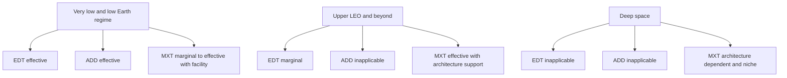
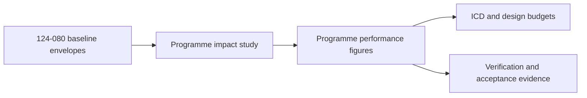

# STA 120-129 · 124-080 — Performance Bounds and Operational Envelopes

## Index

1. [Purpose](#1-purpose)
2. [Scope](#2-scope)
3. [Glossary of Terms and Acronyms](#3-glossary-of-terms-and-acronyms)
4. [Corpus](#4-corpus)
   - [4.1 Performance Framework](#41-performance-framework)
   - [4.2 EDT Performance Envelopes](#42-edt-performance-envelopes)
   - [4.3 MXT Performance Envelopes](#43-mxt-performance-envelopes)
   - [4.4 ADD Performance Envelopes](#44-add-performance-envelopes)
   - [4.5 Combined and Comparative Performance](#45-combined-and-comparative-performance)
   - [4.6 Operational Regime Map](#46-operational-regime-map)
   - [4.7 Interface Summary and Programme Sizing Interface](#47-interface-summary-and-programme-sizing-interface)
5. [Notes](#5-notes)
6. [References](#6-references)
7. [Footprint](#7-footprint)

---

## 1. Purpose

Defines the `080` topic for node `124` and owns **all quantitative performance content** for subsection `124`.

This node establishes parametric performance bounds, validity envelopes, and operational-regime definitions for EDT, MXT, and ADD. It is the only subsection node where absolute values are permitted, and each value is valid only when its envelope conditions are explicitly declared.[^general][^definition]

---

## 2. Scope

- Defines performance bounds as envelope-conditioned quantities rather than context-free single values.
- Provides representative order-of-magnitude parametric ranges for EDT, MXT, and ADD.
- Defines cross-family comparative metrics and regime effectiveness mapping.
- Provides controlled interface from baseline envelopes to programme-specific sizing and verification artefacts.
- Does not redefine family taxonomy (`124-010`) or selection methodology (`124-020`) and does not absorb assurance closure (`124-090`).[^selection][^safety]

---

## 3. Glossary of Terms and Acronyms

| Term / Acronym | Expansion | Meaning in this node |
|---|---|---|
| **Performance bound** | — | Achievable value under explicitly stated configuration and environment conditions. |
| **Validity envelope** | — | Declared condition set under which a bound is applicable. |
| **Duty cycle** | — | Fraction of orbit where useful force or transfer operation is available. |
| **Order-of-magnitude range** | — | Representative range used for baseline taxonomy without certifying programme values. |
| **Regime map** | — | Altitude-inclination-family map classifying effective, marginal, or inapplicable use. |
| **Envelope defect** | — | Governance defect where a figure is cited without validity conditions. |

---

## 4. Corpus

### 4.1 Performance Framework

A performance bound in subsection `124` is never a standalone number. It is always a value tied to a declared envelope: altitude band, environment assumptions, system configuration, and operational mode.

Per `124-000` governance, quoting a figure without envelope is non-compliant. All sibling nodes therefore reference this node when discussing performance.[^general]

### 4.2 EDT Performance Envelopes

Representative EDT envelope ranges for baseline taxonomy are shown below and must be adjusted in programme studies.

| Metric | Representative parametric range | Required validity envelope |
|---|---|---|
| Thrust or drag force | Order of **0.1 to 1 N** for a **5 to 20 km** bare-wire tether in **300 to 500 km** altitude with nominal dayside plasma | Tether length and architecture, altitude band, plasma condition set, geomagnetic geometry, current-control mode |
| Reboost capability | Order of **0.5 to 5 km/day** equivalent altitude recovery for medium-mass class systems under favorable geometry | Orbit inclination, duty cycle, electrical power availability, plasma regime |
| Deorbit from LEO | Order of **months to a few years** depending on drag mode usage and mass-to-tether ratio | Initial altitude, current closure availability, eclipse strategy, host mass and drag baseline |
| Generator-mode power | Order of **hundreds of watts to a few kilowatts** in favorable drag-mode operation | Current path closure, contactor performance, thermal and power electronics limits |

EDT duty cycle is not constant across orbit; geometry and environment can reduce useful-force windows and must be declared in each estimate.[^plasma]

### 4.3 MXT Performance Envelopes

MXT performance is bounded by tether specific strength, spin management, and capture-release accuracy.

| Metric | Representative parametric range | Required validity envelope |
|---|---|---|
| Tip velocity | Order of **1 to 3 km/s** for long high-specific-strength tethers in near-term concepts | Tether material properties, tether length, allowable stress margin, spin regime |
| Delta-v per exchange | Order of **0.5 to 2 km/s** per capture-release event | Facility and payload mass ratio, phase accuracy, release geometry |
| Capture window duration | Order of **seconds to tens of seconds** depending on spin period and grapple envelope | Relative navigation precision, spin rate, grapple dynamics |
| Spin-up energy budget | Order of **tens of megajoules to gigajoules** depending on facility scale | Moment of inertia, spin target, actuator efficiency |

MXT values are highly facility-specific; baseline values remain indicative and not certifying.

### 4.4 ADD Performance Envelopes

ADD performance is dominated by atmospheric model choice, deployed area, and ballistic coefficient.

| Metric | Representative parametric range | Required validity envelope |
|---|---|---|
| Drag force in LEO | Order of **milli-newtons to tens of milli-newtons** for compact satellites with deployed membranes | Altitude, atmospheric model, solar activity state, drag coefficient assumptions |
| Deorbit from 500 km | Order of **several years down to under two years** depending on area gain and solar state | Initial altitude, area-to-mass ratio, atmospheric density model, attitude state |
| Stowed to deployed area ratio | Order of **one to two decades increase** in exposed area | Mechanism class, membrane packing factor, deployment completeness |

ADD envelopes must always include atmosphere model and solar regime declarations.

### 4.5 Combined and Comparative Performance

| Family | Representative capability | Power requirement posture | Environment dependence | Reversibility |
|---|---|---|---|---|
| EDT | Continuous low thrust or drag, plus generator mode | Moderate in thrust mode, low to none in drag mode | High dependence on plasma and geomagnetic conditions | Reversible thrust and drag modes |
| MXT | Discrete high delta-v transfer events | High facility energy for spin operations | Moderate dependence on orbit geometry and operations cadence | Reversible exchange direction in principle |
| ADD | Passive drag-only deorbit acceleration | Deployment-only operational power | High dependence on neutral atmosphere density | Not reversible for reboost |

Comparative interpretation is valid only inside declared envelope sets; numbers are not transferable without condition mapping.

### 4.6 Operational Regime Map

The regime map provides the quantitative basis for qualitative applicability statements in `124-030`, `124-040`, and `124-050`.

### 4.7 Interface Summary and Programme Sizing Interface

| Interface | Direction | Description |
|---|---|---|
| **Family nodes 030 040 050** | `124-080` → sibling nodes | Supplies controlled quantitative envelopes referenced by technique and cross-cutting nodes. |
| **Environment interface 070** | `124-070` → `124-080` | Provides plasma and geomagnetic validity constraints for EDT-related figures. |
| **Assurance 090** | `124-080` ↔ `124-090` | Performance-envelope assumptions feed hazard and disposal assurance cases. |
| **Programme impact studies** | `124-080` → programme docs | Baseline parametric envelopes are specialized into mission-specific ICD and verification values. |

This interface prevents programme values from being hard-coded into baseline taxonomy documents.

---

## 5. Notes

> [!NOTE]
> **N1.** Representative values in this node are order-of-magnitude baselines intended for architectural reasoning, not mission certification.

> [!IMPORTANT]
> **N2.** Every number must carry its validity envelope. Reuse of isolated figures outside envelope context is a governance non-conformance.[^general]

> [!WARNING]
> **N3.** Cross-family comparisons can be misleading if envelope assumptions differ. Comparative tables are valid only when condition sets are normalized.

> [!NOTE]
> **N4.** Sibling nodes must reference `124-080` for quantitative claims; they should not duplicate absolute values in local narrative sections.[^edt][^mxt][^add]

---

## 6. References

[^baseline]: **Q+ATLANTIDE controlled baseline (v1.0.0)** — [`organization/Q+ATLANTIDE.md`](../../../../organization/Q+ATLANTIDE.md).
[^general]: **Subsection general node (124-000)** — [`124-000-General.md`](./124-000-General.md).
[^definition]: **Controlled definition (124-010)** — [`124-010-Tether-and-Propellantless-Propulsion-Controlled-Definition.md`](./124-010-Tether-and-Propellantless-Propulsion-Controlled-Definition.md).
[^selection]: **Families and selection criteria (124-020)** — [`124-020-Propellantless-Families-and-Selection-Criteria.md`](./124-020-Propellantless-Families-and-Selection-Criteria.md).
[^perf]: **Performance bounds and operational envelopes (124-080)** — [`124-080-Performance-Bounds-and-Operational-Envelopes.md`](./124-080-Performance-Bounds-and-Operational-Envelopes.md).
[^safety]: **Safety, debris and assurance boundaries (124-090)** — [`124-090-Safety-Debris-and-Assurance-Boundaries.md`](./124-090-Safety-Debris-and-Assurance-Boundaries.md).
[^subsection]: **Subsection index (124 · Propulsión Sin Propelente y Amarras)** — [`README.md`](./README.md).
[^section]: **Section index (120-129 · Propulsión Espacial Tradicional y Avanzada)** — [`../README.md`](../README.md).
[^archtable]: **STA §3 Architecture Table** — [`../../README.md` §3](../../README.md#3-architecture-table).
[^xref]: **Cross-Architecture Propulsion References** — [`129-070`](../129_Aseguramiento-Calificacion-y-Expansion-de-Propulsion/129-070-Cross-Architecture-Propulsion-References.md).
[^edt]: **Electrodynamic tether systems (124-030)** — [`124-030-Electrodynamic-Tether-Systems.md`](./124-030-Electrodynamic-Tether-Systems.md).
[^mxt]: **Momentum exchange and spinning tethers (124-040)** — [`124-040-Momentum-Exchange-and-Spinning-Tethers.md`](./124-040-Momentum-Exchange-and-Spinning-Tethers.md).
[^add]: **Aerodynamic drag and deorbit devices (124-050)** — [`124-050-Aerodynamic-Drag-and-Deorbit-Devices.md`](./124-050-Aerodynamic-Drag-and-Deorbit-Devices.md).
[^plasma]: **Plasma and geomagnetic environment interface (124-070)** — [`124-070-Plasma-and-Geomagnetic-Environment-Interface.md`](./124-070-Plasma-and-Geomagnetic-Environment-Interface.md).

---

## 7. Footprint

**Document footprint — controlled provenance and evidence anchor.**

| Field | Value |
|---|---|
| Document ID | `QATL-STA-120-129-124-080` |
| Register | Q+ATLANTIDE1000 |
| Path | `Q+ATLANTIDE/100-199_STA/120-129_Propulsion-Espacial-Tradicional-y-Avanzada/124_Propulsion-Sin-Propelente-y-Amarras/124-080-Performance-Bounds-and-Operational-Envelopes.md` |
| Governance class | baseline |
| Owning Q-Division | Q-SPACE |
| Support Q-Divisions | Q-GREENTECH, Q-STRUCTURES, Q-DATAGOV, Q-HPC, Q-HORIZON |
| ORB functions | ORB-PMO, ORB-LEG |
| Version | 1.0.0 |
| Status | draft-of-record |
| Language | en |
| Evidence anchor (IEF) | `<sha256: to-be-stamped-at-commit>` |
| Programme applicability | none at baseline (quantitative envelope node; programme values via impact studies) |

**Change log.**

| Version | Date | Author / Division | Change |
|---|---|---|---|
| 1.0.0 | 2026-05-29 | Q-SPACE | Initial baseline issue of `124-080` Performance Bounds and Operational Envelopes node. |

**Footprint notes.** This node is the quantitative authority for subsection 124 and enforces envelope-conditioned interpretation of all figures. It provides representative parametric ranges for EDT, MXT, and ADD, comparative framing, and regime mapping while remaining programme-agnostic. Programme-specific values are derived by impact studies and mapped into ICD and verification artefacts under `S1000D-CSDB/DMC/`. The evidence anchor is stamped at commit under IEF governance; until stamped this node remains `draft-of-record`.
