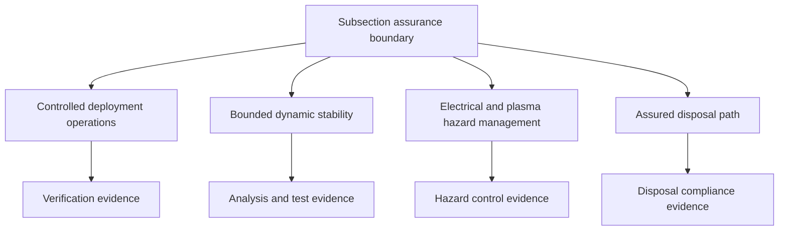
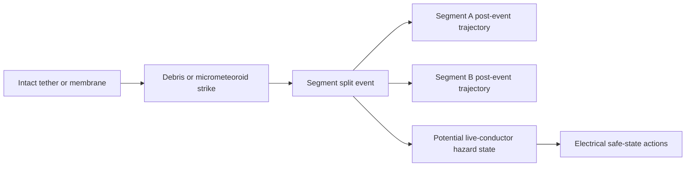
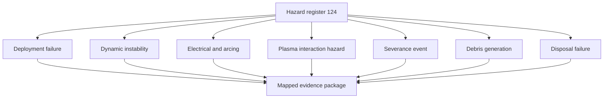

# STA 120-129 · 124-090 — Safety, Debris and Assurance Boundaries

## Index

1. [Purpose](#1-purpose)
2. [Scope](#2-scope)
3. [Glossary of Terms and Acronyms](#3-glossary-of-terms-and-acronyms)
4. [Corpus](#4-corpus)
   - [4.1 Assurance Framework](#41-assurance-framework)
   - [4.2 Severance Analysis](#42-severance-analysis)
   - [4.3 Debris Generation and Orbital-Traffic Coordination](#43-debris-generation-and-orbital-traffic-coordination)
   - [4.4 Assured Disposal](#44-assured-disposal)
   - [4.5 Hazard Register Structure](#45-hazard-register-structure)
   - [4.6 Evidence Requirements and Traceability](#46-evidence-requirements-and-traceability)
   - [4.7 Interface Summary and Interface to Section Assurance](#47-interface-summary-and-interface-to-section-assurance)
5. [Notes](#5-notes)
6. [References](#6-references)
7. [Footprint](#7-footprint)

---

## 1. Purpose

Defines the `090` assurance topic for node `124` and closes the subsection safety loop.

This node expands the inherited assurance boundary into testable requirement classes, hazard structure, debris and severance logic, assured disposal requirements, and evidence-traceability expectations. It provides the controlled assurance interface from subsection `124` toward section-level qualification and disposal governance in node `129`.[^xref]

---

## 2. Scope

- Owns safety-case decomposition for deployment control, dynamic stability bounds, electrical and plasma hazard management, and assured disposal closure.
- Owns debris and severance assurance framing and orbital-traffic coordination boundaries.
- Owns evidence-type requirements and traceability linkage to IEF and programme CSDB artefacts.
- Defers family architecture content to `124-030`, `124-040`, and `124-050`, deployment mechanics detail to `124-060`, and quantitative envelopes to `124-080`.[^edt][^mxt][^add][^deploy][^perf]
- Inherits controlled definition and selection method from `124-010` and `124-020`.[^definition][^selection]

---

## 3. Glossary of Terms and Acronyms

| Term / Acronym | Expansion | Meaning in this node |
|---|---|---|
| **Assurance boundary** | — | Controlled conditions that must hold for safe deployment and lifecycle operation. |
| **Severance** | — | Physical split of tether or deployed element by impact or overload event. |
| **Hazard register** | — | Structured list of hazard categories with mitigation and evidence mapping. |
| **Disposal closure** | — | Demonstrated end-of-life path meeting policy constraints independent of nominal host operations. |
| **IEF** | Integrated Evidence Framework | Traceability anchor for evidence records tied to requirements and hazards. |
| **Orbital traffic coordination** | — | Authority and process interface for tracking and conjunction-risk handling. |

---

## 4. Corpus

### 4.1 Assurance Framework

Subsection `124` assurance is decomposed into four requirement pillars inherited from `124-000`: controlled deployment and possible retraction or jettison, bounded dynamic stability, electrical and plasma hazard management, and assured disposal path closure.[^general]

Each pillar must map to verifiable evidence classes and explicit acceptance criteria at programme level.

### 4.2 Severance Analysis

Severance risk is represented as impact flux, exposed cross-section, and mission duration interactions. The structural mechanics of severance are covered in `124-060`; this node controls consequence and assurance treatment.

Mitigation includes multi-strand concepts, controlled current shutdown logic, and post-event state management. Probability and traffic outcomes remain linked to debris policy and conjunction governance.

### 4.3 Debris Generation and Orbital-Traffic Coordination

A deployed tether or membrane is a trackable orbital object with traffic coordination obligations. Conjunction management constraints differ from compact spacecraft because large deployed geometries reduce maneuver agility and can constrain avoidance options.

Coordination interfaces include ORB-LEG policy alignment, object-state reporting, and contingency communication protocols for deployment anomalies or severance events.

### 4.4 Assured Disposal

Disposal closure must hold independently of nominal host mission completion. EDT drag mode and dedicated ADD devices provide passive disposal pathways; MXT facilities require dedicated end-of-life disposal plans as persistent large assets.

Disposal policy targets, including legacy 25-year guidance and successors, are interpreted at programme level, but this node requires explicit disposal argument closure for all architectures before acceptance.

### 4.5 Hazard Register Structure

| Hazard category | Primary family impact | Supporting node | Evidence class examples |
|---|---|---|---|
| Deployment failure | EDT MXT ADD | `124-060` | Mechanism tests, deployment simulations, telemetry traces |
| Dynamic instability | EDT MXT ADD | `124-060` | Dynamic models, damping verification, envelope tests |
| Electrical or arcing hazard | EDT primary | `124-070` | Electrical safety analysis, contactor characterization |
| Plasma interaction hazard | EDT primary | `124-070` | Environment-coupling validation and margins |
| Severance event | All families | `124-060` | Structural fault analysis, contingency validation |
| Debris generation | All families | `124-090` | Traffic-risk studies, coordination records |
| Disposal failure | All families | `124-090` | Disposal trajectory evidence and compliance artefacts |

### 4.6 Evidence Requirements and Traceability

Assurance evidence should include analysis, simulation, test, demonstration, and heritage evidence where relevant. Evidence sets must be traceable to requirements and hazard categories, with reproducible assumptions.

Traceability anchor policy is IEF-based at baseline and mapped to programme `S1000D-CSDB/DMC/` structures for implementation-level documents.

### 4.7 Interface Summary and Interface to Section Assurance

| Interface | Direction | Description |
|---|---|---|
| **Technique and cross-cutting nodes** | 030 040 050 060 070 080 → 090 | Inputs for hazard and assurance closure synthesis. |
| **Section assurance policy** | `124-090` → `129-030` | Feeds qualification and acceptance boundary logic. |
| **Disposal governance** | `124-090` → `129-050` | Feeds disposal and planetary-protection related boundary checks. |
| **Cross-architecture references** | `124-090` ↔ `129-070` | Registers managed dependencies and assurance interactions. |
| **ORB legal and operations** | Bidirectional | Orbital-traffic coordination requirements and evidence obligations. |

Mission applicability boundary: this node applies to every mission adopting subsection 124 techniques because assurance closure is mandatory regardless of selected family.

---

## 5. Notes

> [!NOTE]
> **N1.** Assurance closure is architecture-independent: any selected family in subsection `124` inherits the same four pillar requirement structure.[^general]

> [!IMPORTANT]
> **N2.** Evidence without traceable assumptions and requirement linkage cannot satisfy baseline assurance governance.

> [!WARNING]
> **N3.** A severed conductive EDT segment can retain hazardous electrical state; safe-state current shutdown and post-event traffic handling must be pre-validated.[^edt][^deploy]

> [!NOTE]
> **N4.** This node aggregates and governs hazard closure; it does not duplicate family architecture or dynamic-physics ownership from sibling nodes.[^edt][^mxt][^add][^deploy]

---

## 6. References

[^baseline]: **Q+ATLANTIDE controlled baseline (v1.0.0)** — [`organization/Q+ATLANTIDE.md`](../../../../organization/Q+ATLANTIDE.md).
[^general]: **Subsection general node (124-000)** — [`124-000-General.md`](./124-000-General.md).
[^definition]: **Controlled definition (124-010)** — [`124-010-Tether-and-Propellantless-Propulsion-Controlled-Definition.md`](./124-010-Tether-and-Propellantless-Propulsion-Controlled-Definition.md).
[^selection]: **Families and selection criteria (124-020)** — [`124-020-Propellantless-Families-and-Selection-Criteria.md`](./124-020-Propellantless-Families-and-Selection-Criteria.md).
[^perf]: **Performance bounds and operational envelopes (124-080)** — [`124-080-Performance-Bounds-and-Operational-Envelopes.md`](./124-080-Performance-Bounds-and-Operational-Envelopes.md).
[^safety]: **Safety, debris and assurance boundaries (124-090)** — [`124-090-Safety-Debris-and-Assurance-Boundaries.md`](./124-090-Safety-Debris-and-Assurance-Boundaries.md).
[^subsection]: **Subsection index (124 · Propulsión Sin Propelente y Amarras)** — [`README.md`](./README.md).
[^section]: **Section index (120-129 · Propulsión Espacial Tradicional y Avanzada)** — [`../README.md`](../README.md).
[^archtable]: **STA §3 Architecture Table** — [`../../README.md` §3](../../README.md#3-architecture-table).
[^xref]: **Cross-Architecture Propulsion References** — [`129-070`](../129_Aseguramiento-Calificacion-y-Expansion-de-Propulsion/129-070-Cross-Architecture-Propulsion-References.md).
[^edt]: **Electrodynamic tether systems (124-030)** — [`124-030-Electrodynamic-Tether-Systems.md`](./124-030-Electrodynamic-Tether-Systems.md).
[^mxt]: **Momentum exchange and spinning tethers (124-040)** — [`124-040-Momentum-Exchange-and-Spinning-Tethers.md`](./124-040-Momentum-Exchange-and-Spinning-Tethers.md).
[^add]: **Aerodynamic drag and deorbit devices (124-050)** — [`124-050-Aerodynamic-Drag-and-Deorbit-Devices.md`](./124-050-Aerodynamic-Drag-and-Deorbit-Devices.md).
[^deploy]: **Conductive elements, deployment and dynamics (124-060)** — [`124-060-Conductive-Elements-Deployment-and-Dynamics.md`](./124-060-Conductive-Elements-Deployment-and-Dynamics.md).

---

## 7. Footprint

**Document footprint — controlled provenance and evidence anchor.**

| Field | Value |
|---|---|
| Document ID | `QATL-STA-120-129-124-090` |
| Register | Q+ATLANTIDE1000 |
| Path | `Q+ATLANTIDE/100-199_STA/120-129_Propulsion-Espacial-Tradicional-y-Avanzada/124_Propulsion-Sin-Propelente-y-Amarras/124-090-Safety-Debris-and-Assurance-Boundaries.md` |
| Governance class | baseline |
| Owning Q-Division | Q-SPACE |
| Support Q-Divisions | Q-GREENTECH, Q-STRUCTURES, Q-DATAGOV, Q-HPC, Q-HORIZON |
| ORB functions | ORB-PMO, ORB-LEG |
| Version | 1.0.0 |
| Status | draft-of-record |
| Language | en |
| Evidence anchor (IEF) | `<sha256: to-be-stamped-at-commit>` |
| Programme applicability | none at baseline (assurance node; programme closure via qualification artefacts) |

**Change log.**

| Version | Date | Author / Division | Change |
|---|---|---|---|
| 1.0.0 | 2026-05-29 | Q-SPACE | Initial baseline issue of `124-090` Safety, Debris and Assurance Boundaries node. |

**Footprint notes.** This node closes the assurance boundary for subsection 124 by mapping hazard classes to evidence requirements and section-level assurance interfaces. It integrates deployment, dynamics, environment, and performance assumptions from sibling nodes into a governed safety posture without duplicating their technical ownership. Programme-specific hazard logs, verification matrices, and disposal dossiers are generated under impact studies and mapped to `S1000D-CSDB/DMC/`. IEF evidence anchor stamping occurs at commit; until then, this document is `draft-of-record`.
